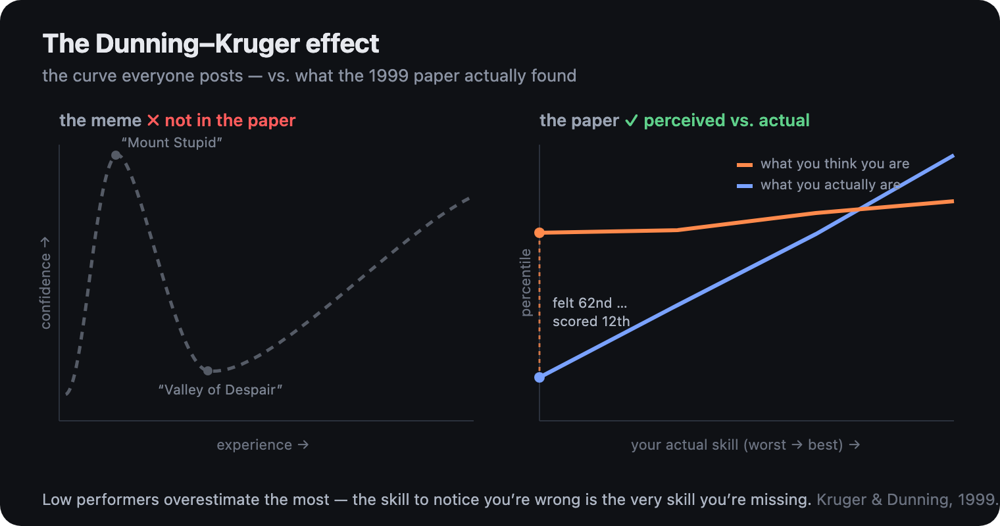

<h1 align="center">Dunning Kruger</h1>

<p align="center"><em>Find out how much of your own codebase you actually understand &mdash; before it bites you.</em></p>

<p align="center"></p>

---

You build something with AI. It works. You feel sharp.

Then a week later someone asks how it works, and you realize you're not totally sure. You
wrote it, kind of. You watched it get written. But could you explain it cold? Could you
change it without quietly breaking three other things? There's a beat where you're not
certain &mdash; and you move past it, because the thing runs and there's more to ship.

That gap &mdash; between *feeling* like you understand your code and *actually* understanding
it &mdash; is the whole story here. And it's older than AI.

## What the research actually says

In 1999, Justin Kruger and David Dunning ran the experiment (the chart up top &uarr;). People
who were worst at a task were the most confident they were good at it. The bottom slice scored
around the **12th percentile** and guessed they were around the **62nd**.

Not arrogance. A **dual burden**: the skill you need to do something well is the same skill you
need to notice you're doing it badly. If you don't have it, you can't feel its absence.

Two honest footnotes, because this is for people who'll check:

- **The "Mount Stupid" curve everyone posts isn't in the paper.** It's a later cartoon of it.
  The real finding is just *low performers overestimate* &mdash; no hill, no journey.
- **The effect is contested** (Krueger & Mueller 2002; Gignac & Zajenkowski 2020 &mdash; some of
  it may be regression to the mean). The debate is real. This tool measures *your* calibration
  on *your* code; it doesn't claim to settle the psychology.

The dual burden lands hard in the AI era: you vibe-code a feature, it works, you feel like you
get it &mdash; but the part that would tell you whether you *actually* do is the part you skipped.

## So it does the uncomfortable, useful thing

It sits you down and asks you to explain your own code &mdash; from memory, no peeking. Then it
checks your answers against what the code actually does and shows you, plainly, where you were
fooling yourself, and exactly what to go read.

The questions are a **technical interview about your decisions, not a quiz about syntax** &mdash;
closer to *"why did you reach for DynamoDB instead of Postgres here?"* than *"what does line 42
do?"* That one-sharp-question-at-a-time framing is borrowed from
[Matt Pocock's `grill-me`](https://github.com/mattpocock/skills) (MIT), pointed at code you've
already written instead of a plan you're about to. And you can dial how high- or low-level it
probes: `--level=high` for pure design rationale (and *"what alternative did you reject?"*),
`--level=low` to walk the exact control flow, with the default sitting in between.

```text
$ dk interview ./my-app

  priceOrder  (orders.ts:8)
    you rated 5/5 (100%)  ·  measured 2/5 (40%)
    → to learn: what breaks if `order` is null · who calls this
    next: read the discount branch — summarize() depends on its return

  ── Where you actually landed ──────────────────────────────
    confidence (what you felt):   88%
    competence (what you showed): 41%
    gap: +47%  ·  confidence ran ahead of competence

  3 of 5 answers came in under what you'd have guessed.
  That's not a verdict — it's your reading list. Start with the weakest.
```

It's **growth, not gotcha.** The most hopeful part of Kruger & Dunning's work is buried in their
fourth study: when they *taught* people the skill, people got better at judging themselves too.
So this doesn't just hand you a number &mdash; it teaches the part you missed, then asks again, and
shows you the climb. Run `dk curve` and it writes a shareable HTML card of where you landed.

## Honest about the grading (and your keys)

> **It never sends your code to an API key you don't already own.**

- **In a Claude session** (`/dunning-kruger`): the model already in your session is the judge.
  It reads your real code and grades *comprehension* &mdash; mechanism, invariants, failure modes,
  blast radius &mdash; not whether you parroted the function names. This is the smart path.
- **Standalone CLI** (`dk`): a deterministic keyword check by default &mdash; honest as a *recall
  smoke-test*, not real understanding. Add `--smart` and it shells out to your *own*
  `claude -p` / `codex` (your subscription, **no third-party key**) for real grading. ("No key"
  isn't "fully offline" &mdash; `--smart` does hand the relevant code and your answers to that tool,
  which is yours.)

Either way it shows its work, down to the line, so you can argue with it.

## See your black boxes &mdash; as a knowledge graph

`dk vault ./my-app` exports your repo as an **Obsidian vault**: one note per function, every
`[[wikilink]]` a call edge, and the folders become your **domains**. Open it in Obsidian, hit
*Graph view*, and you're looking at the shape of your codebase. The twist: each node is **colored
by how well you explained it** &mdash; 🔴 black box, 🟠 shaky, 🟢 understood, ⚪ not yet tested.
So your comprehension gaps light up *on the actual structure of your code*. Interview more, and more
of the graph turns green. (We render nothing &mdash; Obsidian is the dashboard; we just emit
markdown + a graph color-config.)

## A second job: ownership

Beyond "how well do I know this repo," there's the more useful question right before you ship:
**do I understand this change well enough to own it?** Point it at a PR or a diff and it tests
your grasp of the *blast radius* &mdash; what breaks downstream, the failure modes, the untested
paths &mdash; and hands back a ship-readiness checklist instead of a personality score.

## Quickstart

```bash
# install the Claude Code skill (symlinks it, so this repo stays the source of truth)
./install.sh

# optional: have Claude OFFER the check before you merge a PR
./install.sh --claude-md
```

Then, in a Claude Code session inside any repo:

```
/dunning-kruger     # reads the room: a change in flight → ownership review; clean repo → the interview
```

Or the standalone CLI, no session needed (`--smart` grades via your own `claude`/`codex`):

```bash
npm i && npm run dk -- interview /path/to/your/ts/repo
npm run dk -- vault /path/to/your/ts/repo     # export the Obsidian comprehension graph
```

---

<sub>One session is a single calibration point, not a curve &mdash; the trajectory is the real thing,
so run it again as you learn. MIT licensed. &nbsp;·&nbsp; Kruger, J., & Dunning, D. (1999).
Unskilled and unaware of it. <em>Journal of Personality and Social Psychology, 77</em>(6),
1121&ndash;1134.</sub>
